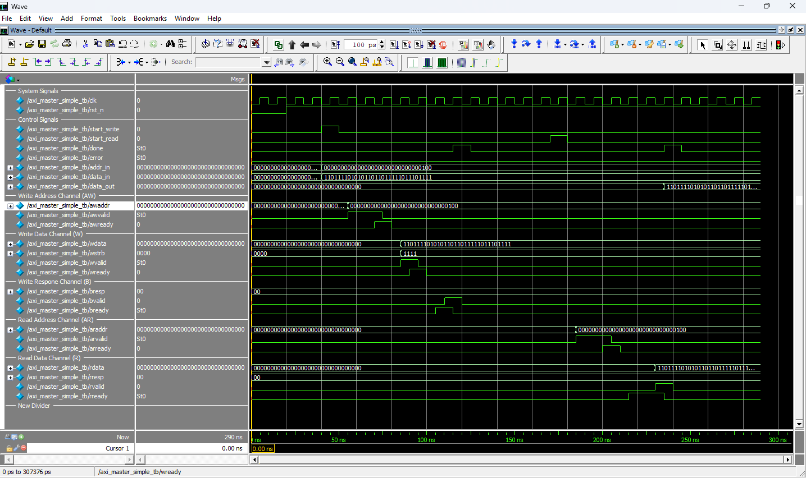
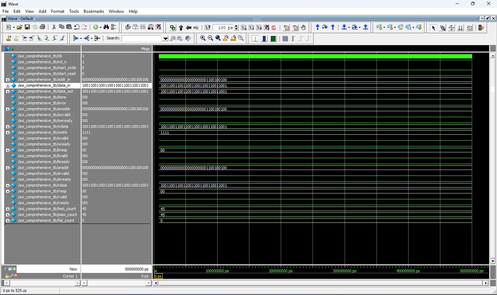
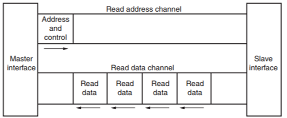

# AXI4-Lite Master–Slave Protocol Verification (Verilog HDL)

This repository contains a **complete RTL design and verification** of an AMBA **AXI4-Lite master–slave subsystem** written in **Verilog HDL** and verified using **ModelSim**.  
The project focuses on designing independent FSMs for the master and slave, implementing the AXI4-Lite protocol accurately, and proving correct operation through simulation waveforms and a 45-test regression suite.

'''

## Repository Overview

rtl/ → AXI4-Lite Master & Slave source files
tb/ → Unit, Integration, and Regression Testbenches
sim/ → ModelSim simulation scripts (.do files)
waveforms/ → Verified waveform screenshots
docs/ → AXI4-Lite protocol explanation

Each folder serves a specific purpose so that anyone opening the repo can easily trace the full design and verification flow.

'''

## Project Summary

- Fully AXI4-Lite compliant design with all five channels implemented  
- Independent FSMs for both master and slave  
- 4 KB memory-mapped slave with byte-enable (`WSTRB`) support  
- Decoupled address and data phases (no artificial coupling)  
- Support for continuous back-to-back transactions  
- Complete functional verification through directed tests and waveform proof  
- Achieved **100 % pass rate (45/45 tests)** in the comprehensive testbench  

---

## Design Highlights

### **AXI4-Lite Master**
- Handles write and read sequences independently.  
- Generates and controls `AWVALID`, `WVALID`, and `ARVALID` signals.  
- Waits for proper `READY` handshake on each channel before proceeding.  
- Implements sequential back-to-back transfers without idle gaps.

### **AXI4-Lite Slave**
- Implements a 4 KB internal memory space for read/write operations.  
- Decodes byte strobes (`WSTRB`) to support partial word writes.  
- Provides appropriate `OKAY` responses (`BRESP`, `RRESP`).  
- Fully handshake-compliant with proper READY/VALID timing.

---

## Verification Strategy

Three levels of testbenches were written to verify functionality from basic to exhaustive coverage.

| Level | Testbench | Purpose |
|-------|------------|---------|
| Unit | `axi4_lite_master_simple_tb.v` | Basic read/write transaction checks for master behavior |
| Integration | `axi_integration_tb.v` | Full master–slave communication, verifying correct handshakes and data transfer |
| Regression | `axi_comprehensive_tb.v` | Directed suite of **45 tests** covering simultaneous transactions, back-to-back transfers, and error scenarios |

Final test results:

TOTAL TESTS = 45
PASS COUNT = 45
FAIL COUNT = 0

yaml
Copy code

---

## Protocol Waveform Proof

### 1️. Simple Master Test


A single write followed by a read transaction.  
All five channels (`AW`, `W`, `B`, `AR`, `R`) complete valid handshakes with stable data and address phases.

---

### 2️. Integration Test


Shows the master and slave operating together across multiple transactions.  
`AWVALID` and `WVALID` are decoupled correctly, responses are ordered, and memory read-back matches the written data.

---

### 3️. Comprehensive 45-Test Regression


Demonstrates the self-checking testbench running 45 directed tests.  
All tests pass, confirming protocol compliance and data integrity across all scenarios.

---

## How to Run Simulations

From the `sim/` directory in ModelSim:

```tcl
vlog ../rtl/*.v ../tb/*.v
vsim work.axi_integration_tb
do wave.do
run -all
The wave.do script loads all relevant signals and color-codes each AXI channel for clarity.

Documentation
For a detailed explanation of the AXI4-Lite protocol and this project’s architecture, refer to:

docs/axi4_lite_overview.md

It covers channel behavior, handshake timing, FSM design, and verification methodology.

## AXI Write and Read Transactions

### AXI Write Transaction


This waveform illustrates a **single AXI4-Lite write transaction**:
- The master asserts `AWVALID` with a valid address.
- The slave acknowledges with `AWREADY`.
- Write data (`WDATA`) is sent with `WVALID` and accepted with `WREADY`.
- After the memory write completes, the slave issues `BVALID` with `BRESP = OKAY`.
- The master drives `BREADY` to complete the write response handshake.

This verifies correct operation of the **write address, data, and response channels**.

---

### AXI Read Transaction


This waveform shows a **single AXI4-Lite read transaction**:
- The master initiates the read by asserting `ARVALID` with a valid address.
- The slave accepts it using `ARREADY`.
- The slave responds with `RVALID` and provides `RDATA` along with `RRESP = OKAY`.
- The master asserts `RREADY` to accept the data.
- The read data matches previously written memory contents, confirming **data integrity**.

These waveforms demonstrate correct VALID/READY handshaking, channel decoupling, and complete AXI4-Lite compliance.


Key Learning Outcomes
Strong understanding of the AXI4-Lite protocol

Experience designing independent FSMs for interface logic

Verification methodology using self-checking testbenches

Hands-on exposure to ModelSim scripting and waveform debugging

Industry-style documentation and version control with Git/GitHub

Author
Tanmay Rambha
Final-Year ECE | RTL Design & Verification

Final Note
This project was built from the ground up — starting with protocol understanding, followed by RTL design, and ending with complete functional verification.
All waveforms and documentation are original, and the repository is organized to reflect real-world VLSI design and verification workflows.